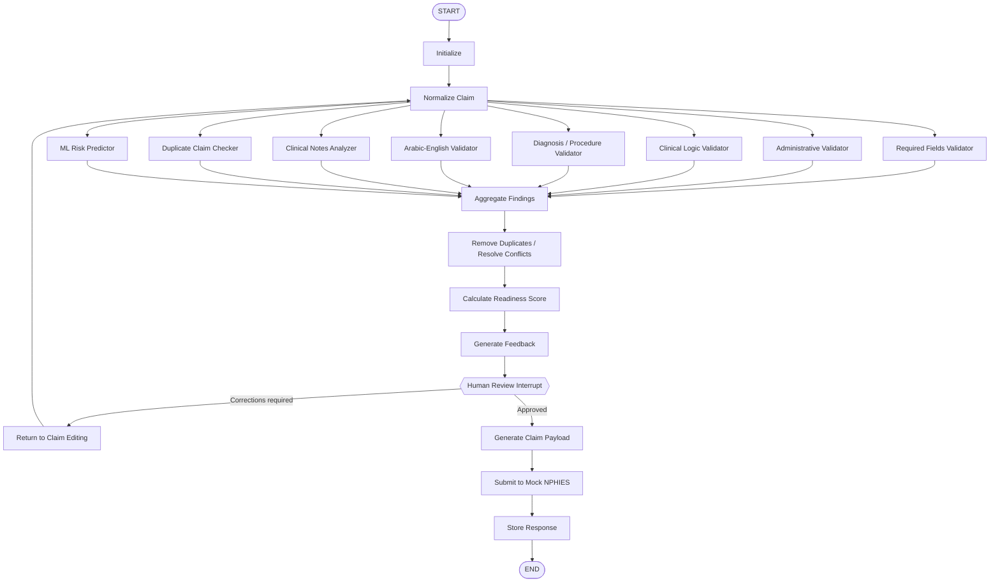

# Aoun Workflow

```mermaid
flowchart TD
    S([START]) --> I[Initialize] --> N[Normalize Claim]
    N --> R[Required Fields Validator]
    N --> A[Administrative Validator]
    N --> C[Clinical Logic Validator]
    N --> D[Diagnosis / Procedure Validator]
    N --> B[Arabic-English Validator]
    N --> T[Clinical Notes Analyzer]
    N --> U[Duplicate Claim Checker]
    N --> M[ML Risk Predictor]
    R & A & C & D & B & T & U & M --> G[Aggregate Findings]
    G --> X[Remove Duplicates / Resolve Conflicts]
    X --> Q[Calculate Readiness Score] --> F[Generate Feedback]
    F --> H{{Human Review Interrupt}}
    H -->|Corrections required| E[Return to Claim Editing] --> N
    H -->|Approved| P[Generate Claim Payload]
    P --> API[Submit to Mock NPHIES] --> SR[Store Response] --> Z([END])
```
